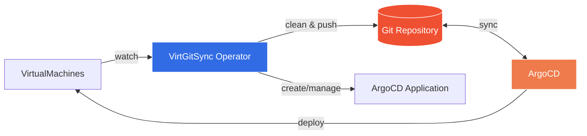
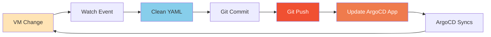

# VirtGitSync Operator

A Kubernetes operator that watches KubeVirt VirtualMachine resources and syncs them to git repositories for complete GitOps workflows with ArgoCD.

## Description

VirtGitSync enables GitOps for KubeVirt VirtualMachines by automatically pushing cleaned VM manifests to git and managing ArgoCD Applications with manual sync control. This creates a single source of truth in git while preventing race conditions between VM changes and ArgoCD reconciliation.

**Key Features:**
- **Automatic git sync**: VM changes pushed to git repository in real-time
- **Zero drift**: YAML cleaning eliminates runtime metadata for Argo CD compatibility
- **ArgoCD integration**: Automatically creates and manages Application CRs with manual sync control
- **Manual sync control**: Operator triggers ArgoCD syncs only after git push completes
- **Comprehensive auth**: SSH keys and HTTPS tokens via Kubernetes Secrets
- **Change tracking**: Descriptive commit messages with VM change details
- **Status visibility**: Git and ArgoCD status tracked in VirtGitSync CR

## Architecture



📊 **[Detailed Architecture Diagrams](docs/architecture.md)** - See comprehensive architecture, data flow, and reconciliation workflows.

## Quick Start

### Prerequisites
- Kubernetes cluster v1.26+ with KubeVirt installed
- ArgoCD installed (optional, but recommended)
- Git repository (GitHub, GitLab, Gitea, etc.)
- SSH key or token for git authentication

### Installation

Install CRDs and deploy the operator:

```bash
make install
make deploy IMG=quay.io/mathianasj/virt-git-sync-operator:v2.0.0
```

Or run locally for development:

```bash
make install
make run
```

**If using ArgoCD integration**, install the required RBAC for ArgoCD to manage VirtualMachines:

```bash
make install-argocd-rbac
```

This grants the ArgoCD application controller permission to manage VirtualMachine resources cluster-wide. Skip this step if you're only using git sync without ArgoCD.

### Basic Example: Git Sync Only

Create a Secret with your SSH private key:

```bash
kubectl create secret generic git-ssh-key \
  --from-file=ssh-private-key=$HOME/.ssh/id_rsa \
  -n default
```

Create a VirtGitSync resource:

```yaml
apiVersion: virt.mathianasj.github.com/v1alpha1
kind: VirtGitSync
metadata:
  name: vm-sync
  namespace: default
spec:
  gitRepository:
    url: git@github.com:myorg/vm-manifests.git
    branch: main
    secretRef:
      name: git-ssh-key
```

Apply the resource:

```bash
kubectl apply -f virtgitsync.yaml
```

The operator will sync all VirtualMachines in the namespace to `vms/default/*.yaml` in your git repository.

### Full Example: With ArgoCD Integration

```yaml
apiVersion: virt.mathianasj.github.com/v1alpha1
kind: VirtGitSync
metadata:
  name: vm-gitops
  namespace: production
spec:
  vmSelector:
    matchLabels:
      managed-by: gitops
  gitRepository:
    url: git@github.com:myorg/vm-manifests.git
    branch: main
    secretRef:
      name: git-ssh-key
  syncPath: vms
  argocd:
    namespace: argocd
    applicationName: production-vms
    destinationNamespace: production
    project: default
```

This creates an ArgoCD Application with automated sync disabled. The operator manually triggers syncs after git pushes.

### Manual Sync Control

The operator **disables ArgoCD's automated sync** and instead manually triggers syncs at the right time:

1. **VM changes** → Operator detects and cleans YAML
2. **Git push** → Changes pushed to repository
3. **Sync trigger** → Operator manually triggers ArgoCD sync (only when git is clean)
4. **ArgoCD applies** → Changes deployed back to cluster

This prevents race conditions where ArgoCD might sync while the operator is still pushing changes to git.

## How It Works



1. **VM Watch**: Operator watches VirtualMachine resources (optionally filtered by labels)
2. **YAML Cleaning**: Strips runtime metadata to prevent drift (resourceVersion, uid, etc.)
3. **Git Commit**: Cleaned YAML committed with descriptive message
4. **Git Push**: Changes pushed to remote repository
5. **Trigger Sync**: Operator manually triggers ArgoCD sync (only when git is clean)
6. **Argo Sync**: ArgoCD syncs VMs from git back to cluster

📊 **[View detailed reconciliation flow](docs/architecture.md#reconciliation-loop)**

## Git Repository Structure

VMs are organized by namespace in your git repository:

```
repo-root/
  vms/                    # syncPath (configurable)
    default/
      vm1.yaml
      vm2.yaml
    production/
      vm3.yaml
      vm4.yaml
```

## Authentication

### SSH Authentication (Recommended)

Create a Secret with your SSH private key:

```bash
kubectl create secret generic git-ssh-key \
  --from-file=ssh-private-key=$HOME/.ssh/id_rsa \
  -n <namespace>
```

Reference in VirtGitSync:
```yaml
spec:
  gitRepository:
    url: git@github.com:myorg/repo.git
    secretRef:
      name: git-ssh-key
```

### HTTPS Authentication

Create a Secret with username and token:

```bash
kubectl create secret generic git-https-auth \
  --from-literal=username=myuser \
  --from-literal=password=ghp_xxxxxxxxxxxx \
  -n <namespace>
```

Reference in VirtGitSync:
```yaml
spec:
  gitRepository:
    url: https://github.com/myorg/repo.git
    secretRef:
      name: git-https-auth
```

## Status Monitoring

Check VirtGitSync status:

```bash
kubectl get virtgitsync vm-sync -o yaml
```

Key status fields:
- `status.gitStatus.lastCommit`: SHA of last successful commit
- `status.gitStatus.lastPush`: Timestamp of last push
- `status.gitStatus.lastError`: Last git error (if any)
- `status.argocdStatus.applicationCreated`: Whether Application CR exists
- `status.argocdStatus.lastUpdated`: Last Application update time

## Configuration Reference

### VirtGitSyncSpec

| Field | Type | Required | Description |
|-------|------|----------|-------------|
| `gitRepository` | GitRepositorySpec | Yes | Git repository configuration |
| `argocd` | ArgoCDSpec | No | ArgoCD Application configuration |
| `syncPath` | string | No | Path within repo for VMs (default: "vms") |
| `vmSelector` | LabelSelector | No | Filter VMs by labels (default: all VMs) |

### GitRepositorySpec

| Field | Type | Required | Description |
|-------|------|----------|-------------|
| `url` | string | Yes | Git repository URL (ssh or https) |
| `branch` | string | No | Branch name (default: "main") |
| `secretRef` | LocalObjectReference | No | Secret with git credentials |

### ArgoCDSpec

| Field | Type | Required | Description |
|-------|------|----------|-------------|
| `namespace` | string | No | ArgoCD namespace (default: "argocd") |
| `applicationName` | string | No | Application name (default: VirtGitSync name) |
| `destinationNamespace` | string | No | Target namespace (default: VirtGitSync namespace) |
| `project` | string | No | ArgoCD project (default: "default") |

**Note:** The operator always disables automated sync and manually controls when ArgoCD syncs. This prevents race conditions between git pushes and ArgoCD syncs.

## Release Process

VirtGitSync uses **fully automated releases**. When you push a version tag, GitHub Actions:

1. ✅ Builds multi-arch images (amd64 + arm64)
2. ✅ Generates and publishes OLM bundle
3. ✅ Creates GitHub release with artifacts
4. ✅ **Automatically creates PRs to OperatorHub.io and OpenShift catalogs**

### Creating a Release

Use the automated release script:

```bash
./release.sh
```

Or manually:

```bash
git tag v0.2.0
git push origin v0.2.0
```

Within minutes, PRs will be automatically created in:
- [`k8s-operatorhub/community-operators`](https://github.com/k8s-operatorhub/community-operators) (OperatorHub.io)
- [`redhat-openshift-ecosystem/community-operators-prod`](https://github.com/redhat-openshift-ecosystem/community-operators-prod) (OpenShift)

**Setup required:** See [Automated Release Process](docs/automated-release-process.md) for one-time GitHub token configuration.

## Development

### Running Tests

```bash
make test                          # All tests
go test ./internal/git/...         # Git manager tests
go test ./internal/argocd/...      # ArgoCD manager tests
go test ./internal/controller/...  # Controller tests
```

### Building

```bash
make build                         # Build manager binary
make docker-build IMG=<image>      # Build container image
make docker-push IMG=<image>       # Push container image
```

### Local Development

Run the operator locally against your kubeconfig cluster:

```bash
make install   # Install CRDs
make run       # Run locally
```

For testing with different architectures (e.g., building on Apple Silicon for OpenShift x86_64):

```bash
make docker-build-amd64 IMG=quay.io/mathianasj/virt-git-sync:dev
./test-install-dev.sh   # Automated OLM installation
```

See [Development Workflow](docs/development-workflow.md) for complete guide including:
- Local vs cluster development
- Multi-architecture builds
- Kustomize overlays for dev/prod
- Testing workflows

## Troubleshooting

### Git Push Fails

**Symptom**: `status.gitStatus.lastError` shows auth error

**Solutions**:
- Verify Secret exists and has correct key name (`ssh-private-key` or `username`/`password`)
- For SSH: Ensure private key has no passphrase
- For HTTPS: Use token instead of password
- Check git URL format matches auth type

### ArgoCD Application Not Created

**Symptom**: `status.argocdStatus.applicationCreated: false`

**Solutions**:
- Verify ArgoCD is installed
- Check ArgoCD namespace in spec matches actual ArgoCD installation
- Review operator logs for RBAC errors
- Ensure operator has permissions for `applications.argoproj.io`

### Argo CD Shows Drift

**Symptom**: Argo shows differences between git and cluster

**Solutions**:
- Verify YAML cleaning: `kubectl diff -f <git-yaml>`
- Check if system fields leaked through
- Review cleanVMForGitOps() logic
- Check operator logs for git push errors

## Migration from v1.x

**Breaking Change**: Git repository is now REQUIRED in v2.0.

If you used v1.x with local `/tmp/vm-sync/` only:
1. Create a git repository
2. Create authentication Secret
3. Update VirtGitSync CR to add `spec.gitRepository`
4. Operator will sync all VMs on next reconcile

No migration path exists for local-only mode.

## Contributing

Contributions welcome! Please:
1. Fork the repository
2. Create a feature branch
3. Add tests for new functionality
4. Ensure all tests pass: `make test`
5. Submit a pull request

## License

Licensed under the Apache License, Version 2.0. See [LICENSE](LICENSE) for details.

## Links

- [KubeVirt Documentation](https://kubevirt.io/)
- [ArgoCD Documentation](https://argo-cd.readthedocs.io/)
- [Operator SDK Documentation](https://sdk.operatorframework.io/)
- [go-git Documentation](https://pkg.go.dev/github.com/go-git/go-git/v5)
