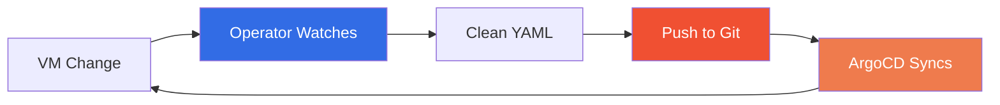
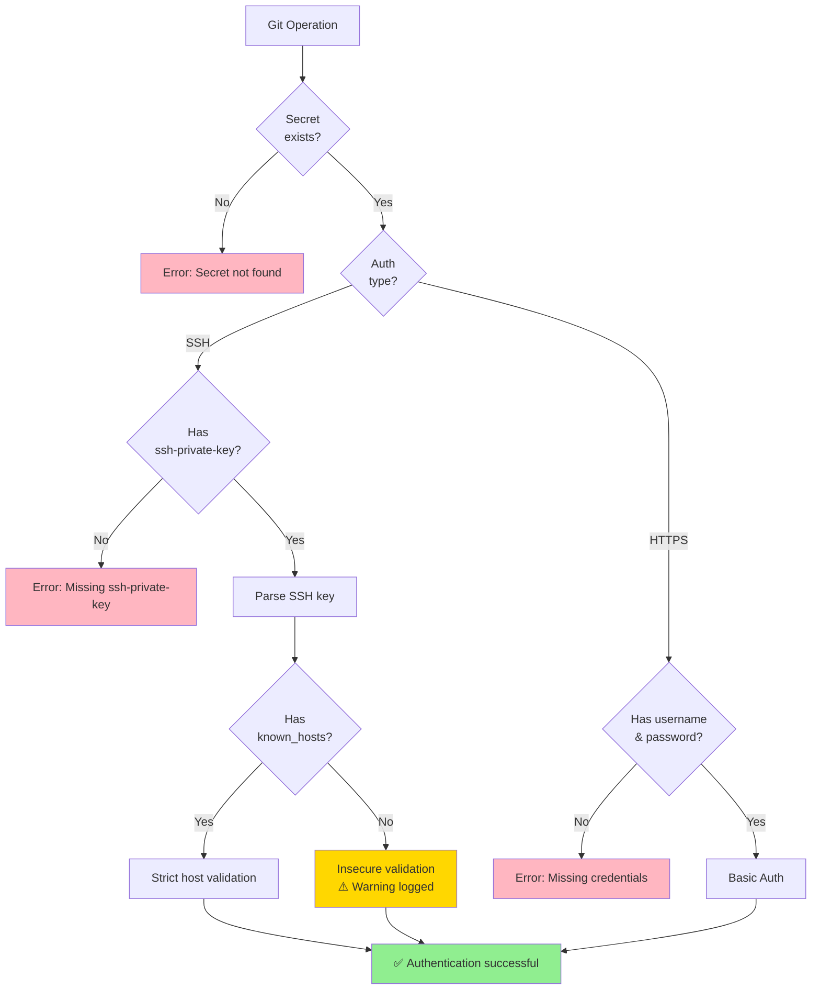
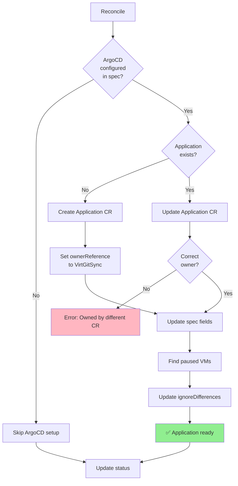

# VirtGitSync Documentation

Visual documentation and diagrams for the VirtGitSync operator.

## 📊 Available Diagrams

### [Architecture](architecture.md)
Comprehensive architecture documentation including:
- **System Architecture** - Component relationships and data flow
- **Data Flow** - Sequence diagram showing VM sync and pause workflows
- **Reconciliation Loop** - Detailed flowchart of the operator's reconciliation process
- **YAML Cleaning Process** - How runtime metadata is stripped for zero-drift GitOps

### [Pause Workflow](pause-workflow.md)
Detailed pause annotation workflow including:
- **Workflow Diagram** - Complete sequence of pause/unpause operations
- **State Transitions** - VM state machine with pause/unpause transitions
- **ignoreDifferences Update** - Flowchart of Application spec updates
- **Use Cases** - Common scenarios with visual examples

## Quick Reference

### Basic Flow



### Component Relationships

| Component | Purpose | Interacts With |
|-----------|---------|----------------|
| **VirtGitSync CR** | Configuration | Controller |
| **Controller** | Reconciliation logic | VMs, Git, ArgoCD Application |
| **Git Manager** | Git operations | Remote repository |
| **ArgoCD Manager** | Application management | Application CRs |
| **VirtualMachine** | Workload | Controller, ArgoCD |
| **ArgoCD Application** | GitOps sync | Git repository, VMs |

### Git Repository Structure

```
repository-root/
├── vms/                          # Default syncPath
│   ├── namespace-1/              # Kubernetes namespace
│   │   ├── vm-1.yaml            # Cleaned VM manifest
│   │   ├── vm-2.yaml
│   │   └── vm-3.yaml
│   ├── namespace-2/
│   │   ├── vm-4.yaml
│   │   └── vm-5.yaml
│   └── production/
│       ├── web-vm.yaml
│       ├── db-vm.yaml
│       └── cache-vm.yaml
└── README.md                     # (optional) repo documentation
```

**Naming Convention**: `{namespace}/{vm-name}.yaml`

**Characteristics**:
- ✅ One file per VM
- ✅ Organized by namespace
- ✅ Consistent naming (no timestamps)
- ✅ Clean, GitOps-ready YAML
- ✅ Single source of truth

## Status Fields Reference

### VirtGitSync Status

```yaml
status:
  gitStatus:
    lastCommit: "a1b2c3d4e5f6..."       # SHA of last commit
    lastPush: "2026-04-27T10:30:00Z"    # Last successful push
    lastError: ""                        # Empty if no errors
  
  argocdStatus:
    applicationCreated: true             # Application CR exists
    applicationName: "my-vms"           # Name of Application
    lastError: ""                        # Empty if no errors
  
  pausedVMs:                             # List of paused VMs
  - name: "vm-1"
    namespace: "default"
  - name: "vm-2"
    namespace: "production"
  
  conditions:
  - type: GitReady
    status: "True"
    reason: "GitOperationsSuccessful"
    message: "Successfully synced to git"
  - type: ArgoCDReady
    status: "True"
    reason: "ApplicationCreated"
    message: "ArgoCD Application is ready"
```

## Annotations

| Annotation | Value | Effect |
|------------|-------|--------|
| `virt-git-sync/pause-argo` | `"true"` | Pauses ArgoCD reconciliation for this VM |
| `virt-git-sync/pause-argo` | (removed) | Resumes ArgoCD reconciliation |

**Example**:
```bash
# Pause
kubectl annotate vm my-vm virt-git-sync/pause-argo="true"

# Resume
kubectl annotate vm my-vm virt-git-sync/pause-argo-
```

## Commit Message Format

### VM Created
```
Create VM default/web-vm (running)
```

### VM Updated
```
Update VM default/web-vm: running: false -> true, memory: 2Gi -> 4Gi
```

### VM Deleted
```
Delete VM default/web-vm
```

## Troubleshooting Diagrams

### Git Authentication Flow



### ArgoCD Application Creation



## Performance Characteristics

| Operation | Typical Latency | Notes |
|-----------|----------------|-------|
| Git clone | 2-10s | Depends on repo size |
| Git pull | 0.5-2s | Shallow clone helps |
| YAML cleaning | <100ms | In-memory operation |
| Git commit | <100ms | Local operation |
| Git push | 1-5s | Network dependent |
| Application update | <500ms | K8s API call |
| Full reconciliation | 3-15s | All operations combined |

## Resource Usage

| Resource | Typical | Peak | Notes |
|----------|---------|------|-------|
| CPU | 10-50m | 200m | Spike during git operations |
| Memory | 64Mi | 128Mi | Depends on VM count |
| Disk | 100Mi | 500Mi | Git working directory |
| Network | 1-10 KB/s | 1 MB/s | During git push/pull |

## Links

- [Main README](../README.md)
- [Release Documentation](../RELEASE.md)
- [Development Guide (CLAUDE.md)](../CLAUDE.md)
- [KubeVirt Documentation](https://kubevirt.io/)
- [ArgoCD Documentation](https://argo-cd.readthedocs.io/)
