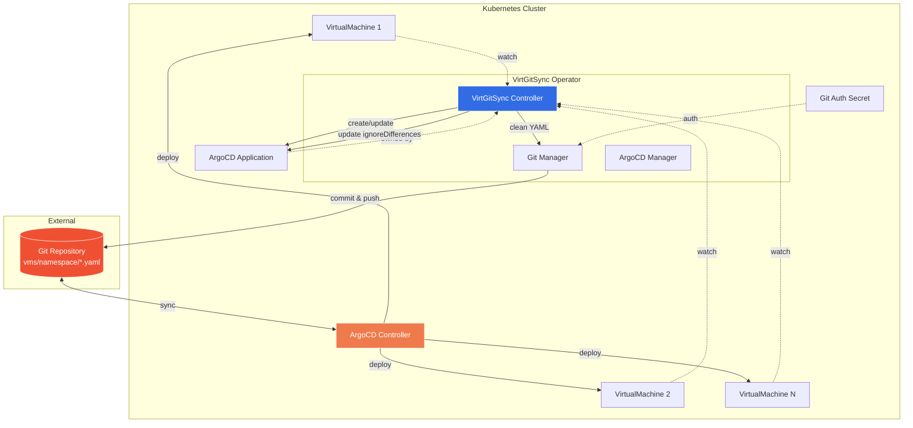
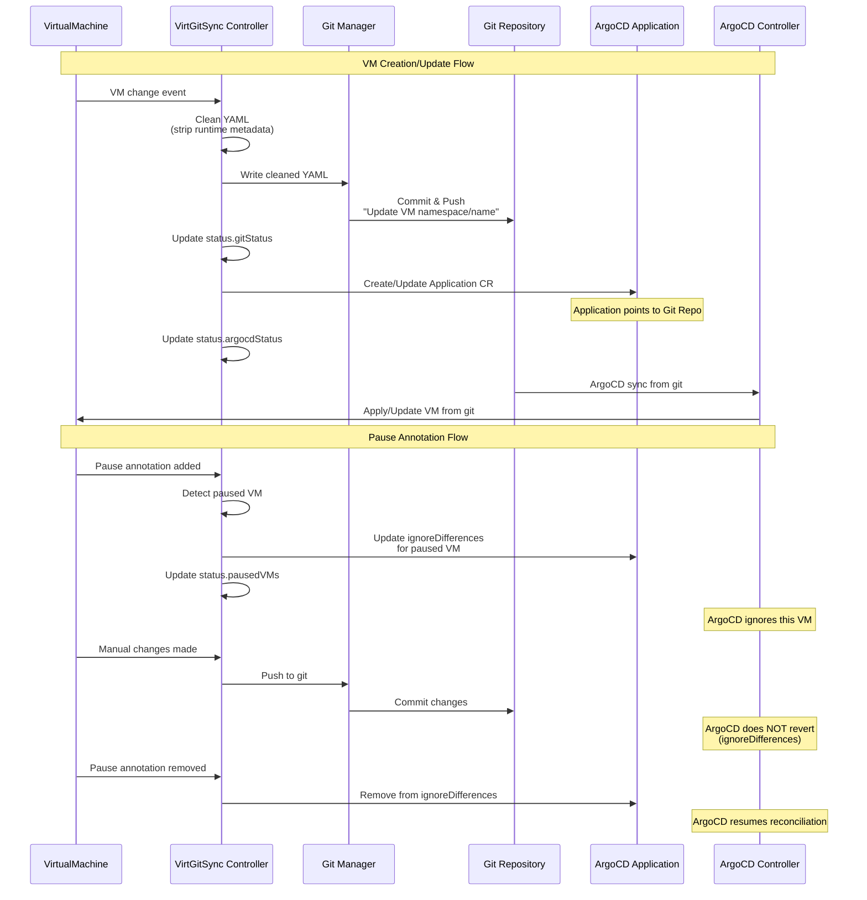
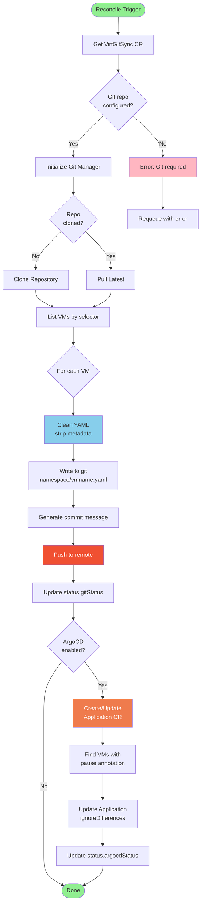
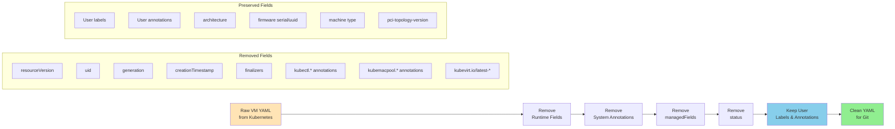

# VirtGitSync Architecture

## System Architecture

```mermaid
graph TB
    subgraph "Kubernetes Cluster"
        VM1[VirtualMachine 1]
        VM2[VirtualMachine 2]
        VM3[VirtualMachine N]
        
        subgraph "VirtGitSync Operator"
            Controller[VirtGitSync Controller]
            GitMgr[Git Manager]
            ArgoMgr[ArgoCD Manager]
        end
        
        Secret[Git Auth Secret]
        App[ArgoCD Application]
        ArgoCD[ArgoCD Controller]
    end
    
    subgraph "External"
        GitRepo[(Git Repository<br/>vms/namespace/*.yaml)]
    end
    
    VM1 -.watch.-> Controller
    VM2 -.watch.-> Controller
    VM3 -.watch.-> Controller
    
    Controller -->|clean YAML| GitMgr
    GitMgr -->|commit & push| GitRepo
    Secret -.auth.-> GitMgr
    
    Controller -->|create/update| App
    App -.owned by.-> Controller
    
    GitRepo <-->|sync| ArgoCD
    ArgoCD -->|deploy| VM1
    ArgoCD -->|deploy| VM2
    ArgoCD -->|deploy| VM3
    
    Controller -->|update ignoreDifferences| App
    
    style Controller fill:#326ce5,stroke:#fff,color:#fff
    style GitRepo fill:#f05032,stroke:#fff,color:#fff
    style ArgoCD fill:#ef7b4d,stroke:#fff,color:#fff
```

## Data Flow

```mermaid
sequenceDiagram
    participant VM as VirtualMachine
    participant Ctrl as VirtGitSync Controller
    participant Git as Git Manager
    participant Repo as Git Repository
    participant Argo as ArgoCD Application
    participant AC as ArgoCD Controller
    
    Note over VM,AC: VM Creation/Update Flow
    
    VM->>Ctrl: VM change event
    Ctrl->>Ctrl: Clean YAML<br/>(strip runtime metadata)
    Ctrl->>Git: Write cleaned YAML
    Git->>Repo: Commit & Push<br/>"Update VM namespace/name"
    Ctrl->>Ctrl: Update status.gitStatus
    
    Ctrl->>Argo: Create/Update Application CR
    Note over Argo: Application points to Git Repo
    Ctrl->>Ctrl: Update status.argocdStatus
    
    Repo->>AC: ArgoCD sync from git
    AC->>VM: Apply/Update VM from git
    
    Note over VM,AC: Pause Annotation Flow
    
    VM->>Ctrl: Pause annotation added
    Ctrl->>Ctrl: Detect paused VM
    Ctrl->>Argo: Update ignoreDifferences<br/>for paused VM
    Ctrl->>Ctrl: Update status.pausedVMs
    
    Note over AC: ArgoCD ignores this VM
    
    VM->>Ctrl: Manual changes made
    Ctrl->>Git: Push to git
    Git->>Repo: Commit changes
    
    Note over AC: ArgoCD does NOT revert<br/>(ignoreDifferences)
    
    VM->>Ctrl: Pause annotation removed
    Ctrl->>Argo: Remove from ignoreDifferences
    
    Note over AC: ArgoCD resumes reconciliation
```

## Reconciliation Loop

```mermaid
flowchart TD
    Start([Reconcile Trigger]) --> GetVGS[Get VirtGitSync CR]
    GetVGS --> CheckGit{Git repo<br/>configured?}
    
    CheckGit -->|No| Error1[Error: Git required]
    CheckGit -->|Yes| InitGit[Initialize Git Manager]
    
    InitGit --> Clone{Repo<br/>cloned?}
    Clone -->|No| DoClone[Clone Repository]
    Clone -->|Yes| DoPull[Pull Latest]
    
    DoClone --> ListVMs
    DoPull --> ListVMs
    
    ListVMs[List VMs by selector] --> ProcessVMs{For each VM}
    
    ProcessVMs --> CleanYAML[Clean YAML<br/>strip metadata]
    CleanYAML --> WriteFile[Write to git<br/>namespace/vmname.yaml]
    WriteFile --> Commit[Generate commit message]
    Commit --> Push[Push to remote]
    Push --> UpdateGitStatus[Update status.gitStatus]
    
    UpdateGitStatus --> CheckArgo{ArgoCD<br/>enabled?}
    
    CheckArgo -->|No| Done
    CheckArgo -->|Yes| CreateApp[Create/Update<br/>Application CR]
    
    CreateApp --> FindPaused[Find VMs with<br/>pause annotation]
    FindPaused --> UpdateIgnore[Update Application<br/>ignoreDifferences]
    UpdateIgnore --> UpdateArgoStatus[Update status.argocdStatus]
    UpdateArgoStatus --> Done([Done])
    
    Error1 --> Requeue[Requeue with error]
    
    style Start fill:#90EE90
    style Done fill:#90EE90
    style Error1 fill:#FFB6C1
    style CleanYAML fill:#87CEEB
    style Push fill:#f05032,color:#fff
    style CreateApp fill:#ef7b4d,color:#fff
```

## YAML Cleaning Process

```mermaid
flowchart LR
    Input[Raw VM YAML<br/>from Kubernetes] --> Strip1[Remove<br/>Runtime Fields]
    Strip1 --> Strip2[Remove<br/>System Annotations]
    Strip2 --> Strip3[Remove<br/>managedFields]
    Strip3 --> Strip4[Remove<br/>status]
    Strip4 --> Keep[Keep User<br/>Labels & Annotations]
    Keep --> Output[Clean YAML<br/>for Git]
    
    subgraph "Removed Fields"
        RF1[resourceVersion]
        RF2[uid]
        RF3[generation]
        RF4[creationTimestamp]
        RF5[finalizers]
        RF6[kubectl.* annotations]
        RF7[kubemacpool.* annotations]
        RF8[kubevirt.io/latest-*]
    end
    
    subgraph "Preserved Fields"
        PF1[User labels]
        PF2[User annotations]
        PF3[architecture]
        PF4[firmware serial/uuid]
        PF5[machine type]
        PF6[pci-topology-version]
    end
    
    style Input fill:#FFE4B5
    style Output fill:#90EE90
    style Keep fill:#87CEEB
```
