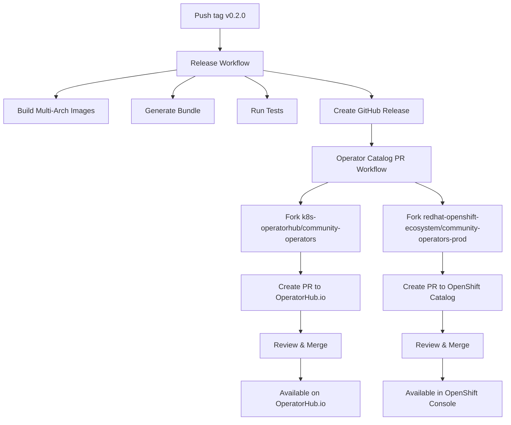

# Automated Release Process

This document describes the fully automated release pipeline for VirtGitSync operator.

## Overview

When you push a version tag, three GitHub Actions workflows orchestrate the complete release:



## Workflows

### 1. Release Workflow (`.github/workflows/release.yml`)

**Trigger:** Push tag matching `v*.*.*`

**Steps:**

1. **Build Multi-Arch Images**
   - Platforms: `linux/amd64`, `linux/arm64`
   - Tagged: `v0.2.0` and `latest`
   - Pushed to: `quay.io/mathianasj/virt-git-sync:v0.2.0`

2. **Generate Bundle**
   - Uses versioned image tag
   - Sets `imagePullPolicy: IfNotPresent` (production default)
   - Validates bundle with operator-sdk

3. **Build and Push Bundle Image**
   - Image: `quay.io/mathianasj/virt-git-sync-bundle:v0.2.0`

4. **Build and Push Catalog Image**
   - Image: `quay.io/mathianasj/virt-git-sync-catalog:v0.2.0`

5. **Run Tests and Linting**
   - Unit tests
   - Integration tests
   - Go linting

6. **Create GitHub Release**
   - Attaches `install.yaml` (CRD + operator deployment)
   - Attaches CRD files
   - Generates release notes from commits

### 2. Operator Catalog PR Workflow (`.github/workflows/operator-catalog-pr.yml`)

**Trigger:** Release published OR manual workflow dispatch

**Job 1: Submit to OperatorHub.io**

1. Checkout virt-git-sync repository
2. Extract version from tag
3. Checkout `k8s-operatorhub/community-operators` (to your fork)
4. Create directory: `operators/virt-git-sync/0.2.0/`
5. Copy bundle contents (manifests, metadata, tests)
6. Create PR with automated description

**Job 2: Submit to OpenShift Catalog**

1. Checkout virt-git-sync repository
2. Extract version from tag
3. Checkout `redhat-openshift-ecosystem/community-operators-prod` (to your fork)
4. Create directory: `operators/virt-git-sync/0.2.0/`
5. Copy bundle contents
6. Create PR with OpenShift-specific description

## Prerequisites

### One-Time Setup

1. **Create Personal Access Token (PAT):**
   ```
   Settings → Developer settings → Personal access tokens → Tokens (classic)
   ```
   - Scopes: `public_repo`, `workflow`
   - Name: "OperatorHub Catalog Submissions"
   - Save the token securely

2. **Add to GitHub Secrets:**
   ```
   Repository → Settings → Secrets and variables → Actions → New repository secret
   ```
   - Name: `OPERATOR_CATALOG_TOKEN`
   - Value: Your PAT

3. **Fork Catalog Repositories:**
   - https://github.com/k8s-operatorhub/community-operators
   - https://github.com/redhat-openshift-ecosystem/community-operators-prod

4. **Configure Quay.io:**
   - Repositories must be **public**
   - Robot account for GitHub Actions (optional but recommended)
   - Add `QUAY_USERNAME` and `QUAY_TOKEN` to GitHub Secrets

### Repository Secrets

| Secret | Required | Purpose |
|--------|----------|---------|
| `QUAY_USERNAME` | Yes | Quay.io username for pushing images |
| `QUAY_TOKEN` | Yes | Quay.io robot account token |
| `OPERATOR_CATALOG_TOKEN` | Yes | GitHub PAT for creating catalog PRs |

## Release Checklist

### Before Release

- [ ] All tests passing: `make test`
- [ ] Bundle validates: `operator-sdk bundle validate ./bundle`
- [ ] Manual testing completed (see [development-workflow.md](./development-workflow.md))
- [ ] CHANGELOG updated with release notes
- [ ] Version bumped in appropriate files
- [ ] CSV icon is custom (not placeholder)
- [ ] Documentation up to date

### Creating a Release

```bash
# Ensure you're on master with latest changes
git checkout master
git pull origin master

# Create and push tag
git tag v0.2.0
git push origin v0.2.0
```

### After Tagging

GitHub Actions automatically:
1. Builds images (~5 minutes)
2. Creates GitHub release (~1 minute)
3. Creates catalog PRs (~2 minutes)

**Total automation time:** ~8 minutes

### Monitor Progress

1. **Release workflow:**
   - https://github.com/mathianasj/virt-git-sync/actions/workflows/release.yml

2. **Catalog PR workflow:**
   - https://github.com/mathianasj/virt-git-sync/actions/workflows/operator-catalog-pr.yml

3. **Created PRs:**
   - Check your fork's branches: `add-virt-git-sync-0.2.0`
   - PRs appear in upstream repos within minutes

### Review Process

Once PRs are created:

1. **OperatorHub.io (k8s-operatorhub/community-operators):**
   - Bot assigns reviewers
   - CI runs: bundle validation, deployment tests
   - Review typically takes 1-3 days
   - Merge makes operator available immediately

2. **OpenShift (redhat-openshift-ecosystem/community-operators-prod):**
   - Bot assigns reviewers
   - CI runs: OpenShift-specific tests
   - Review typically takes 3-7 days
   - Merge makes operator available in next OpenShift catalog sync (24-48h)

### Troubleshooting Failed PRs

**PR Creation Failed:**
- Check `OPERATOR_CATALOG_TOKEN` is valid
- Ensure you forked both catalog repositories
- Verify GitHub Actions permissions

**CI Tests Failing:**
- Check bundle validation: `operator-sdk bundle validate ./bundle`
- Ensure images are publicly accessible
- Review CI logs in the PR

**Review Blocked:**
- Respond to reviewer feedback
- Push fixes to your fork's branch
- CI re-runs automatically

## Version Updates

Each release should increment the version following semantic versioning:

- **Major (1.0.0):** Breaking changes, API incompatibilities
- **Minor (0.2.0):** New features, backwards compatible
- **Patch (0.1.1):** Bug fixes, backwards compatible

### Files to Update

When bumping version:

1. `Makefile`:
   ```makefile
   VERSION ?= 0.2.0
   ```

2. Create new tag:
   ```bash
   git tag v0.2.0
   ```

Everything else is automated!

## Manual Catalog Submission

If you prefer manual submission or automation fails:

See [OPERATOR_CATALOG_SUBMISSION.md](../OPERATOR_CATALOG_SUBMISSION.md) for manual process.

## Architecture

### Multi-Arch Support

Release workflow builds for:
- `linux/amd64` - Intel/AMD x86_64 (most clusters)
- `linux/arm64` - ARM64 (Apple Silicon, ARM servers)

This creates a **multi-arch manifest** that works on both architectures automatically.

### Image Tags

| Tag | Purpose | Updated When |
|-----|---------|--------------|
| `v0.2.0` | Specific version | On release |
| `latest` | Latest stable | On every release |
| `dev` | Development | Manual builds only |

### Bundle Versions

Each release creates a new bundle version in the catalog:

```
operators/virt-git-sync/
├── 0.1.0/          # First release
│   ├── manifests/
│   ├── metadata/
│   └── tests/
└── 0.2.0/          # Second release
    ├── manifests/
    ├── metadata/
    └── tests/
```

OLM automatically handles upgrades between versions.

## Production Deployment

### Via OperatorHub (Recommended)

Once merged to catalogs:

**Kubernetes:**
1. Open https://operatorhub.io/
2. Search "VirtGitSync"
3. Click "Install"
4. Follow instructions

**OpenShift:**
1. Console → Operators → OperatorHub
2. Search "VirtGitSync"
3. Click "Install"
4. Configure namespace and approval strategy

### Via operator-sdk

```bash
operator-sdk run bundle quay.io/mathianasj/virt-git-sync-bundle:v0.2.0
```

### Via kubectl

```bash
kubectl apply -f https://github.com/mathianasj/virt-git-sync/releases/download/v0.2.0/install.yaml
```

## Rollback

To rollback to a previous version:

### In OLM

```bash
# Delete current subscription
kubectl delete subscription virt-git-sync -n operators

# Install previous version
operator-sdk run bundle quay.io/mathianasj/virt-git-sync-bundle:v0.1.0
```

### Without OLM

```bash
# Apply previous release
kubectl apply -f https://github.com/mathianasj/virt-git-sync/releases/download/v0.1.0/install.yaml
```

## Resources

- [Release Workflow](.github/workflows/release.yml)
- [Catalog PR Workflow](.github/workflows/operator-catalog-pr.yml)
- [OLM Documentation](https://olm.operatorframework.io/)
- [OperatorHub.io](https://operatorhub.io/)
- [OpenShift OperatorHub](https://docs.openshift.com/container-platform/latest/operators/understanding/olm-understanding-operatorhub.html)
