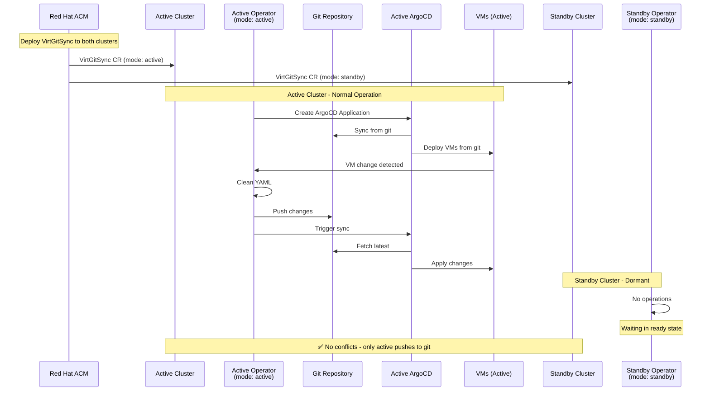
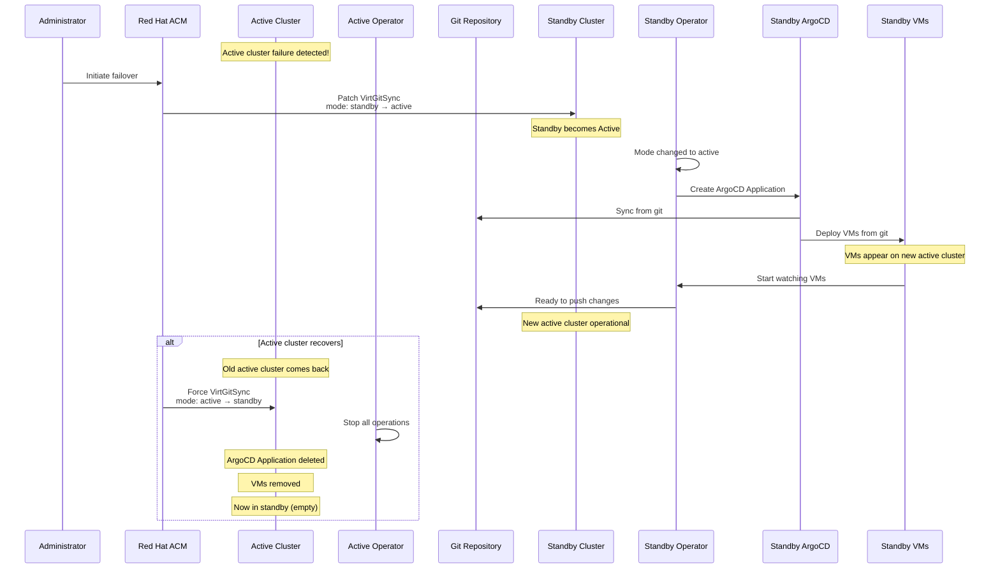
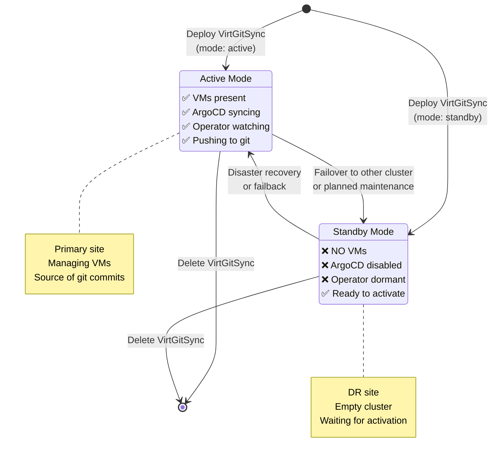
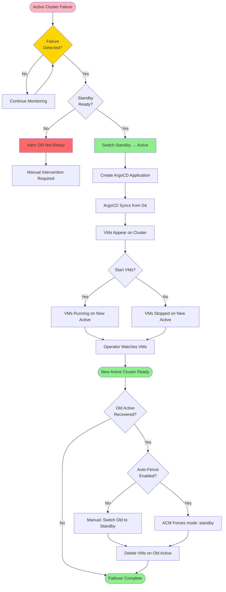
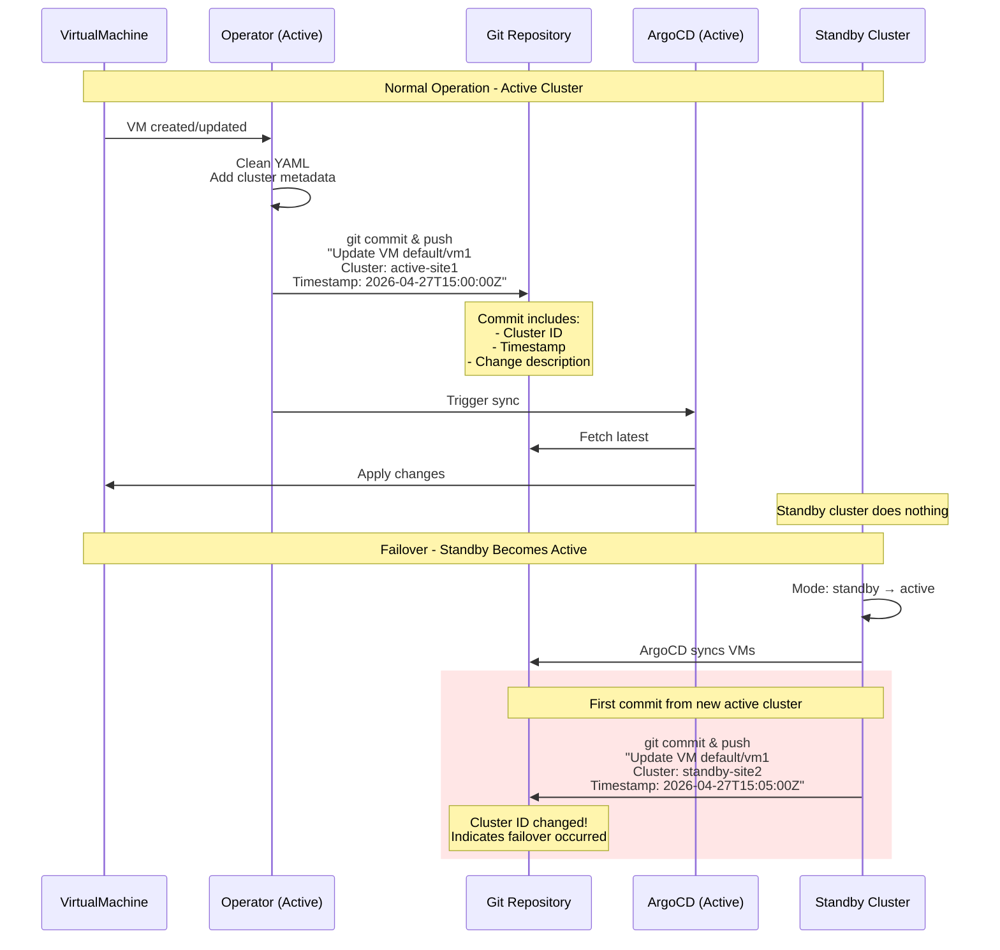
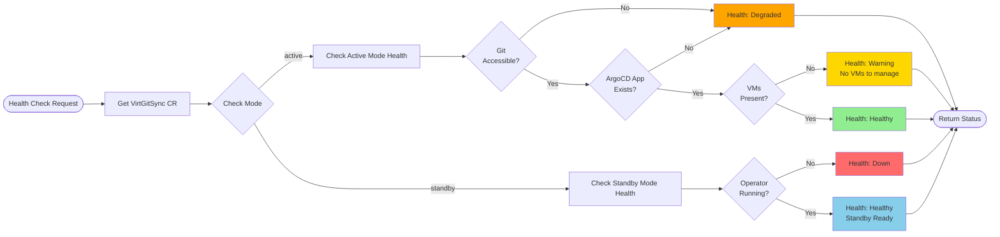
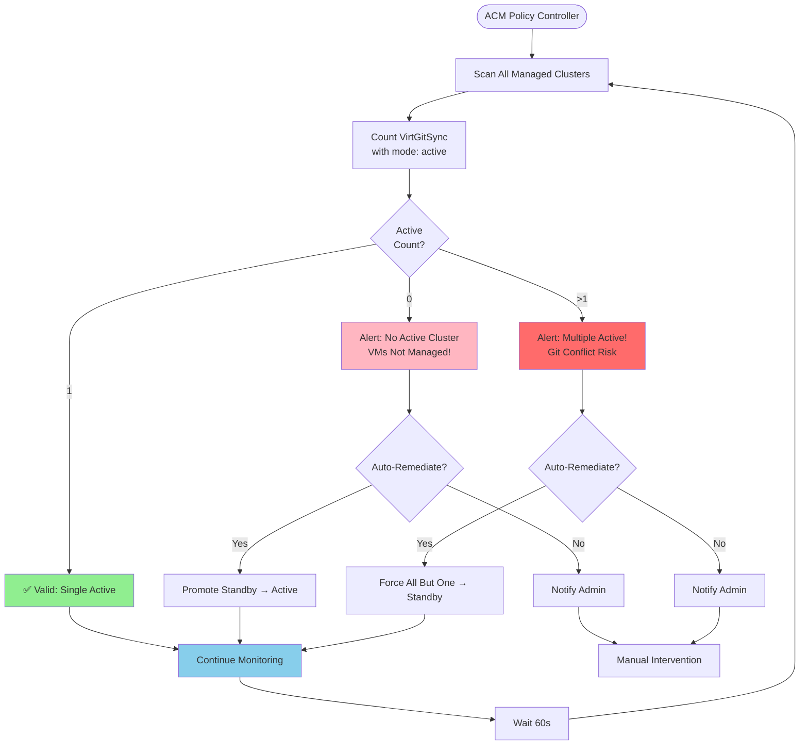
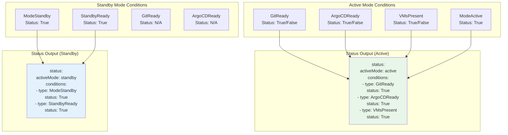

# Active/Standby DR with Red Hat ACM

Visual documentation for multi-cluster disaster recovery using active/standby deployment modes.

## Architecture Overview

```mermaid
graph TB
    subgraph "Active Cluster (Primary Site)"
        A_VMs[VirtualMachines<br/>PRESENT & RUNNING]
        A_Op[virt-git-sync Operator<br/>mode: active]
        A_Argo[ArgoCD Application<br/>SYNCING]
        
        A_VMs -->|watches| A_Op
        A_Op -->|creates/manages| A_Argo
        A_Argo -->|syncs from git| A_VMs
    end
    
    subgraph "Standby Cluster (DR Site)"
        S_Empty[NO VirtualMachines<br/>EMPTY CLUSTER]
        S_Op[virt-git-sync Operator<br/>mode: standby<br/>DORMANT]
        S_NoArgo[ArgoCD Application<br/>DISABLED/DELETED]
        
        S_Empty -.x|no VMs to watch| S_Op
        S_Op -.x|not created| S_NoArgo
    end
    
    subgraph "Git Repository (Source of Truth)"
        Git[(Git Repo<br/>vms/namespace/*.yaml)]
    end
    
    A_Op -->|push changes| Git
    A_Argo <-->|sync| Git
    
    S_Op -.x|no operations| Git
    
    style A_VMs fill:#90EE90
    style A_Op fill:#326ce5,color:#fff
    style A_Argo fill:#ef7b4d,color:#fff
    style Git fill:#f05032,color:#fff
    style S_Empty fill:#FFB6C1
    style S_Op fill:#999,color:#fff
    style S_NoArgo fill:#999,color:#fff
```

## Normal Operation Flow



## Failover Workflow



## State Transitions



## Component State by Mode

```mermaid
graph LR
    subgraph "Active Mode"
        A1[VirtGitSync CR<br/>mode: active]
        A2[ArgoCD Application<br/>EXISTS]
        A3[VirtualMachines<br/>PRESENT]
        A4[Operator<br/>WATCHING]
        A5[Git Operations<br/>PUSH/PULL]
        
        A1 -->|creates| A2
        A2 -->|syncs| A3
        A4 -->|watches| A3
        A4 -->|performs| A5
    end
    
    subgraph "Standby Mode"
        S1[VirtGitSync CR<br/>mode: standby]
        S2[ArgoCD Application<br/>DELETED]
        S3[VirtualMachines<br/>NONE]
        S4[Operator<br/>DORMANT]
        S5[Git Operations<br/>NONE]
        
        S1 -.x|does not create| S2
        S2 -.x|no sync| S3
        S4 -.x|nothing to watch| S3
        S4 -.x|no operations| S5
    end
    
    A1 -.mode change.-> S1
    S1 -.mode change.-> A1
    
    style A1 fill:#326ce5,color:#fff
    style A2 fill:#ef7b4d,color:#fff
    style A3 fill:#90EE90
    style A4 fill:#87CEEB
    style A5 fill:#f05032,color:#fff
    
    style S1 fill:#999,color:#fff
    style S2 fill:#FFB6C1
    style S3 fill:#FFB6C1
    style S4 fill:#999,color:#fff
    style S5 fill:#FFB6C1
```

## Failover Decision Tree



## Multi-Cluster Topology

```mermaid
graph TB
    subgraph "Red Hat ACM Hub"
        ACM[ACM Controller]
        Policy[ACM Policies<br/>Enforce Single Active]
        AppSet[ApplicationSet<br/>Deploy VirtGitSync]
    end
    
    subgraph "Site 1 - Active"
        S1_Cluster[OpenShift Cluster]
        S1_VGS[VirtGitSync<br/>mode: active]
        S1_VMs[VMs<br/>Running]
        S1_Argo[ArgoCD]
        
        S1_VGS -->|watches| S1_VMs
        S1_VGS -->|manages| S1_Argo
    end
    
    subgraph "Site 2 - Standby"
        S2_Cluster[OpenShift Cluster]
        S2_VGS[VirtGitSync<br/>mode: standby]
        S2_NoVMs[No VMs<br/>Empty]
        S2_NoArgo[ArgoCD<br/>Disabled]
        
        S2_VGS -.x|dormant| S2_NoVMs
        S2_VGS -.x|not created| S2_NoArgo
    end
    
    subgraph "External"
        Git[(Git Repository)]
    end
    
    ACM -->|deploys| AppSet
    AppSet -->|cluster 1| S1_VGS
    AppSet -->|cluster 2| S2_VGS
    
    Policy -->|enforces| S1_VGS
    Policy -->|enforces| S2_VGS
    
    S1_VGS -->|push| Git
    S1_Argo <-->|sync| Git
    
    S2_VGS -.x|no operations| Git
    
    style ACM fill:#E00
    style Git fill:#f05032,color:#fff
    style S1_VMs fill:#90EE90
    style S1_VGS fill:#326ce5,color:#fff
    style S2_NoVMs fill:#FFB6C1
    style S2_VGS fill:#999,color:#fff
```

## Git Commit Flow



## Health Check Flow



## ACM Policy Enforcement



## Status Conditions



## Quick Reference

### Mode Comparison Matrix

| Operation | Active | Standby |
|-----------|--------|---------|
| **VMs Present** | ✅ Yes | ❌ No |
| **ArgoCD Application** | ✅ Syncing | ❌ Deleted |
| **Watch VMs** | ✅ Yes | ❌ No |
| **Git Push** | ✅ Yes | ❌ No |
| **Git Pull** | ✅ Yes | ❌ No |
| **Reconcile Loop** | ✅ Active | ❌ Dormant |
| **Resource Usage** | Medium | Minimal |
| **Purpose** | Primary operations | Ready for failover |

### Failover Checklist

```mermaid
graph LR
    C1[☑ Verify git repo accessible]
    C2[☑ Check standby cluster healthy]
    C3[☑ Switch standby → active]
    C4[☑ Verify VMs synced from git]
    C5[☑ Start VMs if needed]
    C6[☑ Switch old active → standby]
    C7[☑ Verify old cluster empty]
    C8[☑ Update monitoring/alerts]
    
    C1 --> C2 --> C3 --> C4 --> C5 --> C6 --> C7 --> C8
    
    style C1 fill:#90EE90
    style C2 fill:#90EE90
    style C3 fill:#FFD700
    style C4 fill:#FFD700
    style C5 fill:#FFD700
    style C6 fill:#FFD700
    style C7 fill:#90EE90
    style C8 fill:#90EE90
```


