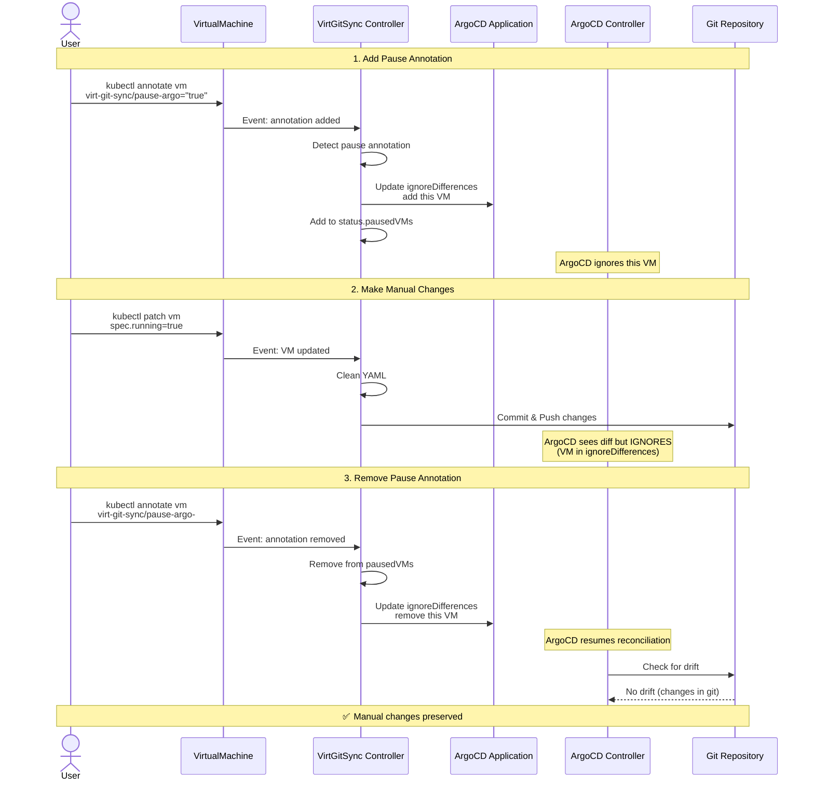
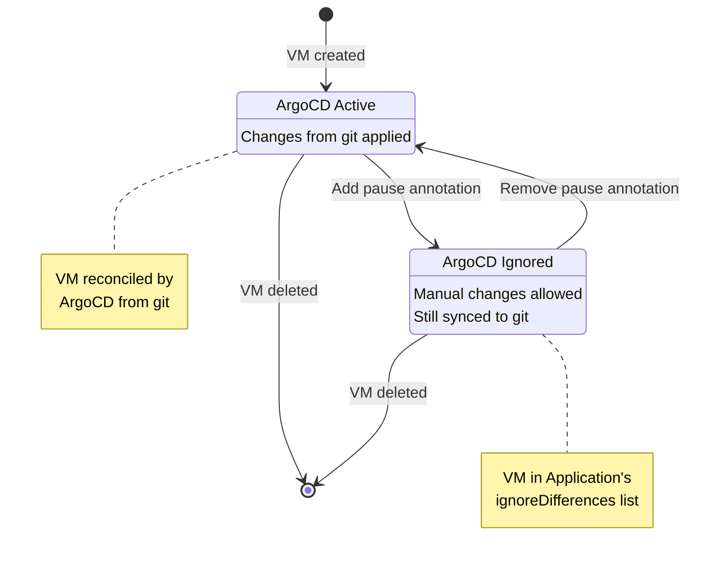
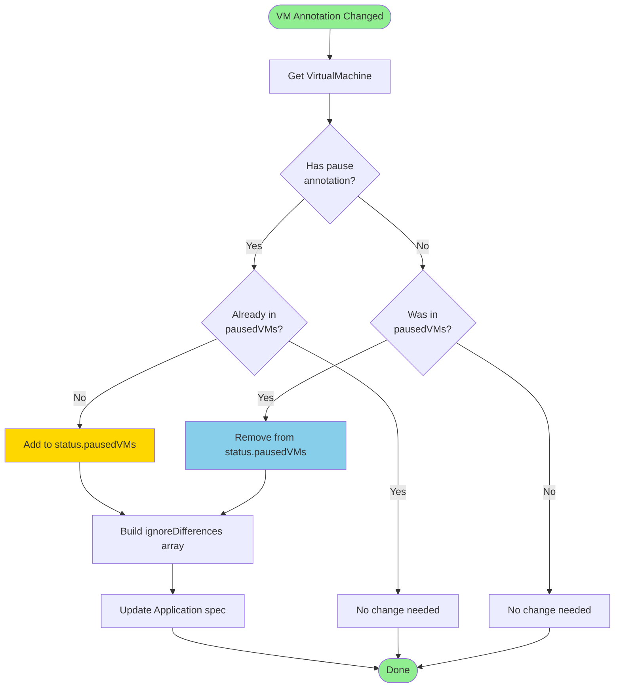
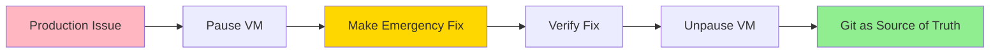
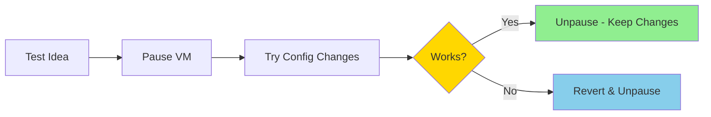
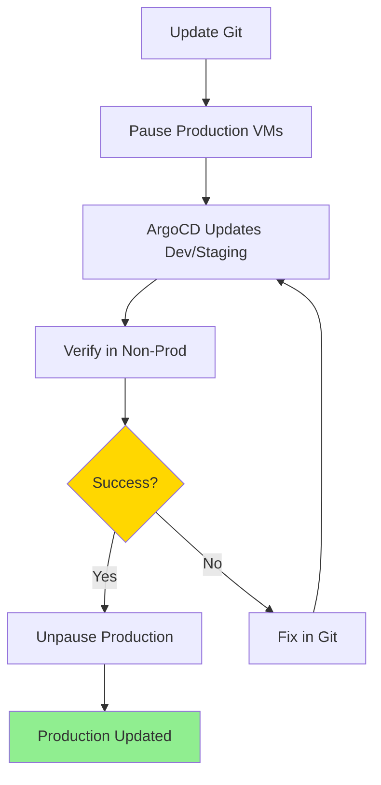

# Pause Annotation Workflow

## Overview

The pause annotation allows you to temporarily prevent ArgoCD from reconciling a specific VirtualMachine, enabling manual changes without Argo reverting them.

## Workflow Diagram



## State Transitions



## ignoreDifferences Update



## Example Application Update

When a VM is paused, the Application's `spec.ignoreDifferences` is updated:

```yaml
apiVersion: argoproj.io/v1alpha1
kind: Application
metadata:
  name: my-vms
  namespace: argocd
spec:
  # ... other fields ...
  
  ignoreDifferences:
  - group: kubevirt.io
    kind: VirtualMachine
    name: paused-vm-1        # VM with pause annotation
    namespace: default
    jsonPointers:
    - /spec
    - /metadata/labels
    - /metadata/annotations
  
  - group: kubevirt.io
    kind: VirtualMachine
    name: paused-vm-2        # Another paused VM
    namespace: production
    jsonPointers:
    - /spec
    - /metadata/labels
    - /metadata/annotations
```

This tells ArgoCD to ignore differences in the spec, labels, and annotations for these specific VMs.

## Use Cases

### 1. Emergency Changes


### 2. Testing Configuration


### 3. Gradual Rollout

